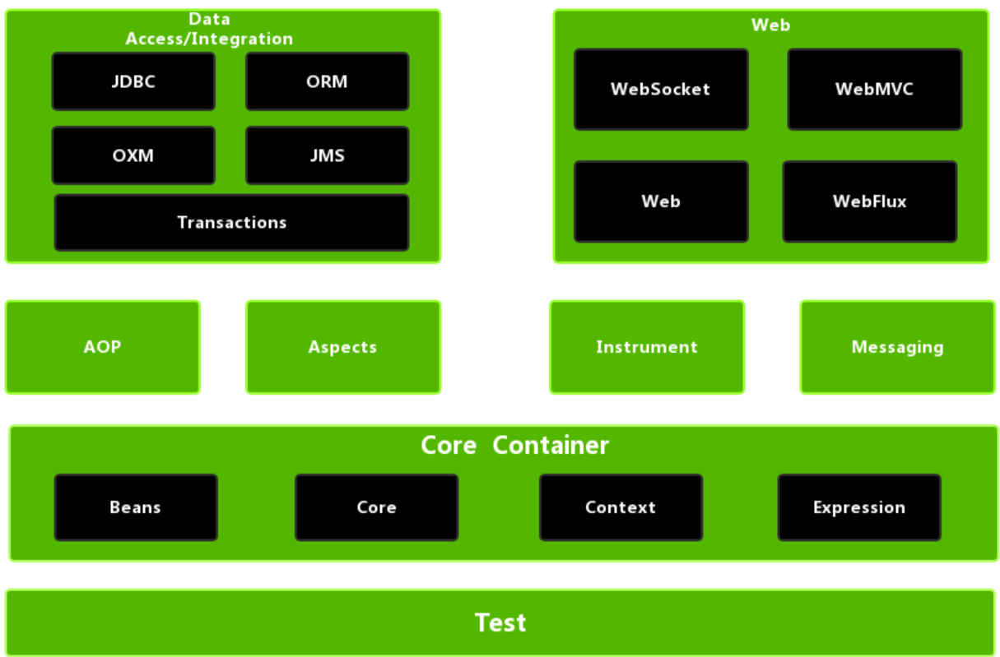
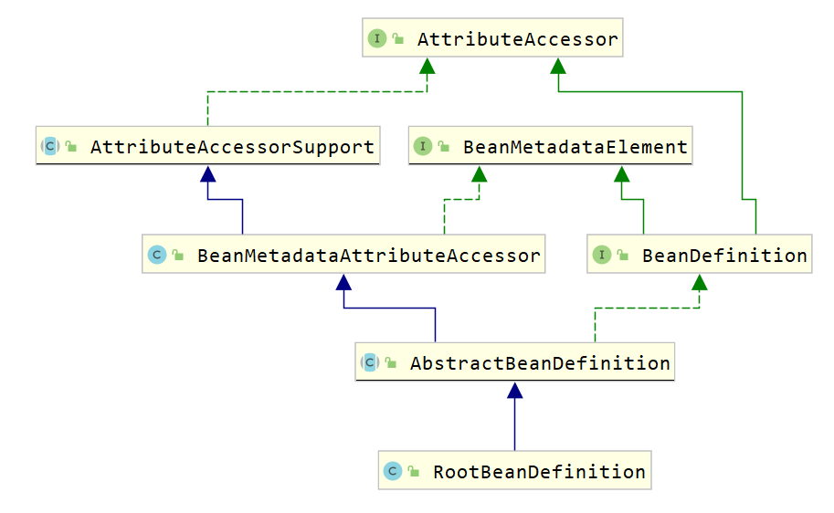

# 自定义Spring框架IOC功能

## 1、项目介绍
&emsp;&emsp;spring框架底层是很复杂的，进行了很深入的封装，并对外提供了很好的扩展性。而我自定义SpringIOC有以下几个目的：
* 了解Spring底层对对象的大体管理机制。
* 了解设计模式在具体的开发中的使用。
* 通过该案例的实现，可以降低spring学习的入门成本。

&emsp;&emsp;本项目属于《造轮子系列》：  
* [《自定义Spring框架IOC功能》](https://github.com/xiaoguangbiao-github/build_wheels_spring_ioc.git)  


## 2、开发环境

- 语言：Java 8

- Eclipse/IDEA

- 依赖管理：Maven


## 3、项目目录
build_wheels_spring_ioc   
&emsp;&emsp;├─spring_demo   &emsp;//spring三层架构（controller、service、dao）的demo  
&emsp;&emsp;│  
&emsp;&emsp;├─interpreter   &emsp;//自定义Spring框架IOC功能  


## 4 spring使用回顾

自定义spring框架前，先回顾一下spring框架的使用，从而分析spring的核心，并对核心功能进行模拟。

* 数据访问层。定义UserDao接口及其子实现类

  ```java
  public interface UserDao {
      public void add();
  }
  
  public class UserDaoImpl implements UserDao {
  
      public void add() {
          System.out.println("userDaoImpl ....");
      }
  }
  ```

* 业务逻辑层。定义UserService接口及其子实现类

  ```java
  public interface UserService {
      public void add();
  }
  
  public class UserServiceImpl implements UserService {
  
      private UserDao userDao;
  
      public void setUserDao(UserDao userDao) {
          this.userDao = userDao;
      }
  
      public void add() {
          System.out.println("userServiceImpl ...");
          userDao.add();
      }
  }
  ```

* 定义UserController类，使用main方法模拟controller层

  ```java
  public class UserController {
      public static void main(String[] args) {
          //创建spring容器对象
          ApplicationContext applicationContext = new ClassPathXmlApplicationContext("applicationContext.xml");
          //从IOC容器中获取UserService对象
          UserService userService = applicationContext.getBean("userService", UserService.class);
          //调用UserService对象的add方法
          userService.add();
      }
  }
  ```

* 编写配置文件。在类路径下编写一个名为ApplicationContext.xml的配置文件

  ```java
  <?xml version="1.0" encoding="UTF-8"?>
  <beans xmlns:xsi="http://www.w3.org/2001/XMLSchema-instance"
         xmlns="http://www.springframework.org/schema/beans"
         xmlns:context="http://www.springframework.org/schema/context"
         xsi:schemaLocation="http://www.springframework.org/schema/beans
          http://www.springframework.org/schema/beans/spring-beans.xsd
          http://www.springframework.org/schema/context
          http://www.springframework.org/schema/context/spring-context.xsd">
  
      <bean id="userService" class="com.xiaoguangbiao.service.impl.UserServiceImpl">
          <property name="userDao" ref="userDao"></property>
      </bean>
  
      <bean id="userDao" class="com.xiaoguangbiao.dao.impl.UserDaoImpl"></bean>
  
  </beans>
  ```

  代码运行结果如下：

  

通过上面代码及结果可以看出：

* userService对象是从applicationContext容器对象获取到的，也就是userService对象交由spring进行管理。
* 上面结果可以看到调用了UserDao对象中的add方法，也就是说UserDao子实现类对象也交由spring管理了。
* UserService中的userDao变量我们并没有进行赋值，但是可以正常使用，说明spring已经将UserDao对象赋值给了userDao变量。

上面三点体现了Spring框架的IOC（Inversion of Control）和DI（Dependency Injection, DI）


## 5 spring核心功能结构

Spring大约有20个模块，由1300多个不同的文件构成。这些模块可以分为:

核心容器、AOP和设备支持、数据访问与集成、Web组件、通信报文和集成测试等，下面是 Spring 框架的总体架构图：




核心容器由 beans、core、context 和 expression（Spring Expression Language，SpEL）4个模块组成。

* spring-beans和spring-core模块是Spring框架的核心模块，包含了控制反转（Inversion of Control，IOC）和依赖注入（Dependency Injection，DI）。BeanFactory使用控制反转对应用程序的配置和依赖性规范与实际的应用程序代码进行了分离。BeanFactory属于延时加载，也就是说在实例化容器对象后并不会自动实例化Bean，只有当Bean被使用时，BeanFactory才会对该 Bean 进行实例化与依赖关系的装配。
* spring-context模块构架于核心模块之上，扩展了BeanFactory，为它添加了Bean生命周期控制、框架事件体系及资源加载透明化等功能。此外，该模块还提供了许多企业级支持，如邮件访问、远程访问、任务调度等，ApplicationContext 是该模块的核心接口，它的超类是 BeanFactory。与BeanFactory不同，ApplicationContext实例化后会自动对所有的单实例Bean进行实例化与依赖关系的装配，使之处于待用状态。
* spring-context-support模块是对Spring IoC容器及IoC子容器的扩展支持。
* spring-context-indexer模块是Spring的类管理组件和Classpath扫描组件。
* spring-expression 模块是统一表达式语言（EL）的扩展模块，可以查询、管理运行中的对象，同时也可以方便地调用对象方法，以及操作数组、集合等。它的语法类似于传统EL，但提供了额外的功能，最出色的要数函数调用和简单字符串的模板函数。EL的特性是基于Spring产品的需求而设计的，可以非常方便地同Spring IoC进行交互。


### 5.1 bean概述

Spring 就是面向 `Bean` 的编程（BOP,Bean Oriented Programming），Bean 在 Spring 中处于核心地位。Bean对于Spring的意义就像Object对于OOP的意义一样，Spring中没有Bean也就没有Spring存在的意义。Spring IoC容器通过配置文件或者注解的方式来管理bean对象之间的依赖关系。

spring中bean用于对一个类进行封装。如下面的配置：

```xml
<bean id="userService" class="com.xiaoguangbiao.service.impl.UserServiceImpl">
    <property name="userDao" ref="userDao"></property>
</bean>
<bean id="userDao" class="com.xiaoguangbiao.dao.impl.UserDaoImpl"></bean>
```

为什么Bean如此重要呢？

* spring 将bean对象交由一个叫IOC容器进行管理。
* bean对象之间的依赖关系在配置文件中体现，并由spring完成。


## 6 Spring IOC相关接口分析

### 6.1 BeanFactory解析

Spring中Bean的创建是典型的工厂模式，这一系列的Bean工厂，即IoC容器，为开发者管理对象之间的依赖关系提供了很多便利和基础服务，在Spring中有许多IoC容器的实现供用户选择，其相互关系如下图所示。


其中，BeanFactory作为最顶层的一个接口，定义了IoC容器的基本功能规范，BeanFactory有三个重要的子接口：ListableBeanFactory、HierarchicalBeanFactory和AutowireCapableBeanFactory。但是从类图中我们可以发现最终的默认实现类是DefaultListableBeanFactory，它实现了所有的接口。

那么为何要定义这么多层次的接口呢？

每个接口都有它的使用场合，主要是为了区分在Spring内部操作过程中对象的传递和转化，对对象的数据访问所做的限制。例如，

* ListableBeanFactory接口表示这些Bean可列表化。
* HierarchicalBeanFactory表示这些Bean 是有继承关系的，也就是每个 Bean 可能有父 Bean
* AutowireCapableBeanFactory 接口定义Bean的自动装配规则。

这三个接口共同定义了Bean的集合、Bean之间的关系及Bean行为。最基本的IoC容器接口是BeanFactory，来看一下它的源码：

```java
public interface BeanFactory {

	String FACTORY_BEAN_PREFIX = "&";

	//根据bean的名称获取IOC容器中的的bean对象
	Object getBean(String name) throws BeansException;
	//根据bean的名称获取IOC容器中的的bean对象，并指定获取到的bean对象的类型，这样我们使用时就不需要进行类型强转了
	<T> T getBean(String name, Class<T> requiredType) throws BeansException;
	Object getBean(String name, Object... args) throws BeansException;
	<T> T getBean(Class<T> requiredType) throws BeansException;
	<T> T getBean(Class<T> requiredType, Object... args) throws BeansException;
	
	<T> ObjectProvider<T> getBeanProvider(Class<T> requiredType);
	<T> ObjectProvider<T> getBeanProvider(ResolvableType requiredType);

	//判断容器中是否包含指定名称的bean对象
	boolean containsBean(String name);
	//根据bean的名称判断是否是单例
	boolean isSingleton(String name) throws NoSuchBeanDefinitionException;
	boolean isPrototype(String name) throws NoSuchBeanDefinitionException;
	boolean isTypeMatch(String name, ResolvableType typeToMatch) throws NoSuchBeanDefinitionException;
	boolean isTypeMatch(String name, Class<?> typeToMatch) throws NoSuchBeanDefinitionException;
	@Nullable
	Class<?> getType(String name) throws NoSuchBeanDefinitionException;
	String[] getAliases(String name);
}
```

在BeanFactory里只对IoC容器的基本行为做了定义，根本不关心你的Bean是如何定义及怎样加载的。正如我们只关心能从工厂里得到什么产品，不关心工厂是怎么生产这些产品的。

BeanFactory有一个很重要的子接口，就是ApplicationContext接口，该接口主要来规范容器中的bean对象是非延时加载，即在创建容器对象的时候就对象bean进行初始化，并存储到一个容器中。


要知道工厂是如何产生对象的，我们需要看具体的IoC容器实现，Spring提供了许多IoC容器实现，比如：

* ClasspathXmlApplicationContext : 根据类路径加载xml配置文件，并创建IOC容器对象。
* FileSystemXmlApplicationContext ：根据系统路径加载xml配置文件，并创建IOC容器对象。
* AnnotationConfigApplicationContext ：加载注解类配置，并创建IOC容器。


### 6.2 BeanDefinition解析

Spring IoC容器管理我们定义的各种Bean对象及其相互关系，而Bean对象在Spring实现中是以BeanDefinition来描述的，如下面配置文件

```xml
<bean id="userDao" class="com.xiaoguangbiao.dao.impl.UserDaoImpl"></bean>

bean标签还有很多属性：
	scope、init-method、destory-method等。
```

其继承体系如下图所示。




### 6.3 BeanDefinitionReader解析

Bean的解析过程非常复杂，功能被分得很细，因为这里需要被扩展的地方很多，必须保证足够的灵活性，以应对可能的变化。Bean的解析主要就是对Spring配置文件的解析。这个解析过程主要通过BeanDefinitionReader来完成，看看Spring中BeanDefinitionReader的类结构图，如下图所示。


看看BeanDefinitionReader接口定义的功能来理解它具体的作用：

```java
public interface BeanDefinitionReader {

	//获取BeanDefinitionRegistry注册器对象
	BeanDefinitionRegistry getRegistry();

	@Nullable
	ResourceLoader getResourceLoader();

	@Nullable
	ClassLoader getBeanClassLoader();

	BeanNameGenerator getBeanNameGenerator();

	/*
		下面的loadBeanDefinitions都是加载bean定义，从指定的资源中
	*/
	int loadBeanDefinitions(Resource resource) throws BeanDefinitionStoreException;
	int loadBeanDefinitions(Resource... resources) throws BeanDefinitionStoreException;
	int loadBeanDefinitions(String location) throws BeanDefinitionStoreException;
	int loadBeanDefinitions(String... locations) throws BeanDefinitionStoreException;
}
```


### 6.4 BeanDefinitionRegistry解析

BeanDefinitionReader用来解析bean定义，并封装BeanDefinition对象，而我们定义的配置文件中定义了很多bean标签，所以就有一个问题，解析的BeanDefinition对象存储到哪儿？答案就是BeanDefinition的注册中心，而该注册中心顶层接口就是BeanDefinitionRegistry。

```java
public interface BeanDefinitionRegistry extends AliasRegistry {

	//往注册表中注册bean
	void registerBeanDefinition(String beanName, BeanDefinition beanDefinition)
			throws BeanDefinitionStoreException;

	//从注册表中删除指定名称的bean
	void removeBeanDefinition(String beanName) throws NoSuchBeanDefinitionException;

	//获取注册表中指定名称的bean
	BeanDefinition getBeanDefinition(String beanName) throws NoSuchBeanDefinitionException;
    
	//判断注册表中是否已经注册了指定名称的bean
	boolean containsBeanDefinition(String beanName);
    
	//获取注册表中所有的bean的名称
	String[] getBeanDefinitionNames();
    
	int getBeanDefinitionCount();
	boolean isBeanNameInUse(String beanName);
}
```

继承结构图如下：


从上面类图可以看到BeanDefinitionRegistry接口的子实现类主要有以下几个：

* DefaultListableBeanFactory

  在该类中定义了如下代码，就是用来注册bean

  ```java
  private final Map<String, BeanDefinition> beanDefinitionMap = new ConcurrentHashMap<>(256);
  ```

* SimpleBeanDefinitionRegistry

  在该类中定义了如下代码，就是用来注册bean

  ```java
  private final Map<String, BeanDefinition> beanDefinitionMap = new ConcurrentHashMap<>(64);
  ```


### 6.5 创建容器

ClassPathXmlApplicationContext对Bean配置资源的载入是从refresh（）方法开始的。refresh（）方法是一个模板方法，规定了 IoC 容器的启动流程，有些逻辑要交给其子类实现。它对 Bean 配置资源进行载入，ClassPathXmlApplicationContext通过调用其父类AbstractApplicationContext的refresh（）方法启动整个IoC容器对Bean定义的载入过程。


## 7 自定义SpringIOC

现要对下面的配置文件进行解析，并自定义Spring框架的IOC对涉及到的对象进行管理。

```xml
<?xml version="1.0" encoding="UTF-8"?>
<beans>
    <bean id="userService" class="com.xiaoguangbiao.service.impl.UserServiceImpl">
        <property name="userDao" ref="userDao"></property>
    </bean>
    <bean id="userDao" class="com.xiaoguangbiao.dao.impl.UserDaoImpl"></bean>
</beans>
```

### 7.1 定义bean相关的pojo类

#### 7.1.1 PropertyValue类

用于封装bean的属性，体现到上面的配置文件就是封装bean标签的子标签property标签数据。

```java
public class PropertyValue {

  private String name;
  private String ref;
  private String value;

  public PropertyValue() {
  }

  public PropertyValue(String name, String ref,String value) {
    this.name = name;
    this.ref = ref;
    this.value = value;
  }

  public String getName() {
    return name;
  }

  public void setName(String name) {
    this.name = name;
  }

  public String getRef() {
    return ref;
  }

  public void setRef(String ref) {
    this.ref = ref;
  }

  public String getValue() {
    return value;
  }

  public void setValue(String value) {
    this.value = value;
  }
}
```


#### 7.1.2 MutablePropertyValues类

一个bean标签可以有多个property子标签，所以再定义一个MutablePropertyValues类，用来存储并管理多个PropertyValue对象。

```java
public class MutablePropertyValues implements Iterable<PropertyValue> {

    private final List<PropertyValue> propertyValueList;

    public MutablePropertyValues() {
        this.propertyValueList = new ArrayList<PropertyValue>();
    }

    public MutablePropertyValues(List<PropertyValue> propertyValueList) {
        this.propertyValueList = (propertyValueList != null ? propertyValueList : new ArrayList<PropertyValue>());
    }

    public PropertyValue[] getPropertyValues() {
        return this.propertyValueList.toArray(new PropertyValue[0]);
    }

    public PropertyValue getPropertyValue(String propertyName) {
        for (PropertyValue pv : this.propertyValueList) {
            if (pv.getName().equals(propertyName)) {
                return pv;
            }
        }
        return null;
    }

    @Override
    public Iterator<PropertyValue> iterator() {
        return propertyValueList.iterator();
    }

    public boolean isEmpty() {
        return this.propertyValueList.isEmpty();
    }

    public MutablePropertyValues addPropertyValue(PropertyValue pv) {
        for (int i = 0; i < this.propertyValueList.size(); i++) {
            PropertyValue currentPv = this.propertyValueList.get(i);
            if (currentPv.getName().equals(pv.getName())) {
                this.propertyValueList.set(i, new PropertyValue(pv.getName(),pv.getRef(), pv.getValue()));
                return this;
            }
        }
        this.propertyValueList.add(pv);
        return this;
    }

    public boolean contains(String propertyName) {
        return getPropertyValue(propertyName) != null;
    }
}
```


#### 7.1.3 BeanDefinition类

BeanDefinition类用来封装bean信息的，主要包含id（即bean对象的名称）、class（需要交由spring管理的类的全类名）及子标签property数据。

```java
public class BeanDefinition {
    private String id;
    private String className;

    private MutablePropertyValues propertyValues;

    public BeanDefinition() {
        propertyValues = new MutablePropertyValues();
    }

    public String getId() {
        return id;
    }

    public void setId(String id) {
        this.id = id;
    }

    public String getClassName() {
        return className;
    }

    public void setClassName(String className) {
        this.className = className;
    }

    public void setPropertyValues(MutablePropertyValues propertyValues) {
        this.propertyValues = propertyValues;
    }

    public MutablePropertyValues getPropertyValues() {
        return propertyValues;
    }
}
```


### 7.2 定义注册表相关类

#### 7.2.1 BeanDefinitionRegistry接口

BeanDefinitionRegistry接口定义了注册表的相关操作，定义如下功能：

* 注册BeanDefinition对象到注册表中
* 从注册表中删除指定名称的BeanDefinition对象
* 根据名称从注册表中获取BeanDefinition对象
* 判断注册表中是否包含指定名称的BeanDefinition对象
* 获取注册表中BeanDefinition对象的个数
* 获取注册表中所有的BeanDefinition的名称

```java
public interface BeanDefinitionRegistry {

    //注册BeanDefinition对象到注册表中
    void registerBeanDefinition(String beanName, BeanDefinition beanDefinition);

    //从注册表中删除指定名称的BeanDefinition对象
    void removeBeanDefinition(String beanName) throws Exception;

    //根据名称从注册表中获取BeanDefinition对象
    BeanDefinition getBeanDefinition(String beanName) throws Exception;

    boolean containsBeanDefinition(String beanName);

    int getBeanDefinitionCount();

    String[] getBeanDefinitionNames();
}
```


#### 7.2.2 SimpleBeanDefinitionRegistry类

该类实现了BeanDefinitionRegistry接口，定义了Map集合作为注册表容器。

```java
public class SimpleBeanDefinitionRegistry implements BeanDefinitionRegistry {

    private Map<String, BeanDefinition> beanDefinitionMap = new HashMap<String, BeanDefinition>();

    @Override
    public void registerBeanDefinition(String beanName, BeanDefinition beanDefinition) {
        beanDefinitionMap.put(beanName,beanDefinition);
    }

    @Override
    public void removeBeanDefinition(String beanName) throws Exception {
        beanDefinitionMap.remove(beanName);
    }

    @Override
    public BeanDefinition getBeanDefinition(String beanName) throws Exception {
        return beanDefinitionMap.get(beanName);
    }

    @Override
    public boolean containsBeanDefinition(String beanName) {
        return beanDefinitionMap.containsKey(beanName);
    }

    @Override
    public int getBeanDefinitionCount() {
        return beanDefinitionMap.size();
    }

    @Override
    public String[] getBeanDefinitionNames() {
        return beanDefinitionMap.keySet().toArray(new String[1]);
    }
}
```


### 7.3 定义解析器相关类

#### 7.3.1 BeanDefinitionReader接口

BeanDefinitionReader是用来解析配置文件并在注册表中注册bean的信息。定义了两个规范：

* 获取注册表的功能，让外界可以通过该对象获取注册表对象。
* 加载配置文件，并注册bean数据。

```java
public interface BeanDefinitionReader {

	//获取注册表对象
    BeanDefinitionRegistry getRegistry();
	//加载配置文件并在注册表中进行注册
    void loadBeanDefinitions(String configLocation) throws Exception;
}
```


#### 7.3.2 XmlBeanDefinitionReader类

XmlBeanDefinitionReader类是专门用来解析xml配置文件的。该类实现BeanDefinitionReader接口并实现接口中的两个功能。

```java
public class XmlBeanDefinitionReader implements BeanDefinitionReader {

    private BeanDefinitionRegistry registry;

    public XmlBeanDefinitionReader() {
        this.registry = new SimpleBeanDefinitionRegistry();
    }

    @Override
    public BeanDefinitionRegistry getRegistry() {
        return registry;
    }

    @Override
    public void loadBeanDefinitions(String configLocation) throws Exception {

        InputStream is = this.getClass().getClassLoader().getResourceAsStream(configLocation);
        SAXReader reader = new SAXReader();
        Document document = reader.read(is);
        Element rootElement = document.getRootElement();
        //解析bean标签
        parseBean(rootElement);
    }

    private void parseBean(Element rootElement) {

        List<Element> elements = rootElement.elements();
        for (Element element : elements) {
            String id = element.attributeValue("id");
            String className = element.attributeValue("class");
            BeanDefinition beanDefinition = new BeanDefinition();
            beanDefinition.setId(id);
            beanDefinition.setClassName(className);
            List<Element> list = element.elements("property");
            MutablePropertyValues mutablePropertyValues = new MutablePropertyValues();
            for (Element element1 : list) {
                String name = element1.attributeValue("name");
                String ref = element1.attributeValue("ref");
                String value = element1.attributeValue("value");
                PropertyValue propertyValue = new PropertyValue(name,ref,value);
                mutablePropertyValues.addPropertyValue(propertyValue);
            }
            beanDefinition.setPropertyValues(mutablePropertyValues);

            registry.registerBeanDefinition(id,beanDefinition);
        }
    }
}
```


### 7.4 IOC容器相关类

#### 7.4.1 BeanFactory接口

在该接口中定义IOC容器的统一规范即获取bean对象。

```java
public interface BeanFactory {
	//根据bean对象的名称获取bean对象
    Object getBean(String name) throws Exception;
	//根据bean对象的名称获取bean对象，并进行类型转换
    <T> T getBean(String name, Class<? extends T> clazz) throws Exception;
}
```


#### 7.4.2 ApplicationContext接口

该接口的所以的子实现类对bean对象的创建都是非延时的，所以在该接口中定义 `refresh()` 方法，该方法主要完成以下两个功能：

* 加载配置文件。
* 根据注册表中的BeanDefinition对象封装的数据进行bean对象的创建。

```java
public interface ApplicationContext extends BeanFactory {
	//进行配置文件加载并进行对象创建
    void refresh() throws IllegalStateException, Exception;
}
```


#### 7.4.3 AbstractApplicationContext类

* 作为ApplicationContext接口的子类，所以该类也是非延时加载，所以需要在该类中定义一个Map集合，作为bean对象存储的容器。

* 声明BeanDefinitionReader类型的变量，用来进行xml配置文件的解析，符合单一职责原则。

  BeanDefinitionReader类型的对象创建交由子类实现，因为只有子类明确到底创建BeanDefinitionReader哪儿个子实现类对象。

```java
public abstract class AbstractApplicationContext implements ApplicationContext {

    protected BeanDefinitionReader beanDefinitionReader;
    //用来存储bean对象的容器   key存储的是bean的id值，value存储的是bean对象
    protected Map<String, Object> singletonObjects = new HashMap<String, Object>();

    //存储配置文件的路径
    protected String configLocation;

    public void refresh() throws IllegalStateException, Exception {

        //加载BeanDefinition
        beanDefinitionReader.loadBeanDefinitions(configLocation);

        //初始化bean
        finishBeanInitialization();
    }

    //bean的初始化
    private void finishBeanInitialization() throws Exception {
        BeanDefinitionRegistry registry = beanDefinitionReader.getRegistry();
        String[] beanNames = registry.getBeanDefinitionNames();

        for (String beanName : beanNames) {
            BeanDefinition beanDefinition = registry.getBeanDefinition(beanName);
            getBean(beanName);
        }
    }
}
```

> 注意：该类finishBeanInitialization()方法中调用getBean()方法使用到了模板方法模式。


#### 7.4.4 ClassPathXmlApplicationContext类

该类主要是加载类路径下的配置文件，并进行bean对象的创建，主要完成以下功能：

* 在构造方法中，创建BeanDefinitionReader对象。
* 在构造方法中，调用refresh()方法，用于进行配置文件加载、创建bean对象并存储到容器中。
* 重写父接口中的getBean()方法，并实现依赖注入操作。

```java
public class ClassPathXmlApplicationContext extends AbstractApplicationContext{

    public ClassPathXmlApplicationContext(String configLocation) {
        this.configLocation = configLocation;
        //构建XmlBeanDefinitionReader对象
        beanDefinitionReader = new XmlBeanDefinitionReader();
        try {
            this.refresh();
        } catch (Exception e) {
        }
    }

    //根据bean的id属性值获取bean对象
    @Override
    public Object getBean(String name) throws Exception {

        //return singletonObjects.get(name);
        Object obj = singletonObjects.get(name);
        if(obj != null) {
            return obj;
        }

        BeanDefinitionRegistry registry = beanDefinitionReader.getRegistry();
        BeanDefinition beanDefinition = registry.getBeanDefinition(name);
        if(beanDefinition == null) {
            return null;
        }
        String className = beanDefinition.getClassName();
        Class<?> clazz = Class.forName(className);
        Object beanObj = clazz.newInstance();
        MutablePropertyValues propertyValues = beanDefinition.getPropertyValues();
        for (PropertyValue propertyValue : propertyValues) {
            String propertyName = propertyValue.getName();
            String value = propertyValue.getValue();
            String ref = propertyValue.getRef();
            if(ref != null && !"".equals(ref)) {

                Object bean = getBean(ref);
                String methodName = StringUtils.getSetterMethodNameByFieldName(propertyName);
                Method[] methods = clazz.getMethods();
                for (Method method : methods) {
                    if(method.getName().equals(methodName)) {
                        method.invoke(beanObj,bean);
                    }
                }
            }

            if(value != null && !"".equals(value)) {
                String methodName = StringUtils.getSetterMethodNameByFieldName(propertyName);
                Method method = clazz.getMethod(methodName, String.class);
                method.invoke(beanObj,value);
            }
        }
        singletonObjects.put(name,beanObj);
        return beanObj;
    }

    @Override
    public <T> T getBean(String name, Class<? extends T> clazz) throws Exception {

        Object bean = getBean(name);
        if(bean != null) {
            return clazz.cast(bean);
        }
        return null;
    }
}
```


### 7.5 自定义Spring IOC总结

#### 7.5.1 使用到的设计模式

* 工厂模式。这个使用工厂模式 + 配置文件的方式。
* 单例模式。Spring IOC管理的bean对象都是单例的，此处的单例不是通过构造器进行单例的控制的，而是spring框架对每一个bean只创建了一个对象。
* 模板方法模式。AbstractApplicationContext类中的finishBeanInitialization()方法调用了子类的getBean()方法，因为getBean()的实现和环境息息相关。
* 迭代器模式。对于MutablePropertyValues类定义使用到了迭代器模式，因为此类存储并管理PropertyValue对象，也属于一个容器，所以给该容器提供一个遍历方式。

spring框架其实使用到了很多设计模式，如AOP使用到了代理模式，选择JDK代理或者CGLIB代理使用到了策略模式，还有适配器模式，装饰者模式，观察者模式等。

#### 7.5.2 符合大部分设计原则

#### 7.5.3 整个设计和Spring的设计还是有一定的出入

spring框架底层是很复杂的，进行了很深入的封装，并对外提供了很好的扩展性。而我们自定义SpringIOC有以下几个目的：

* 了解Spring底层对对象的大体管理机制。
* 了解设计模式在具体的开发中的使用。
* 以后学习spring源码，通过该案例的实现，可以降低spring学习的入门成本。


